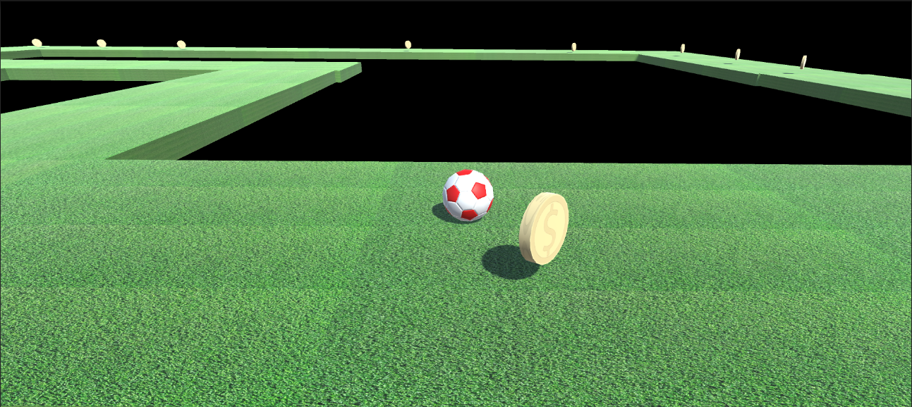
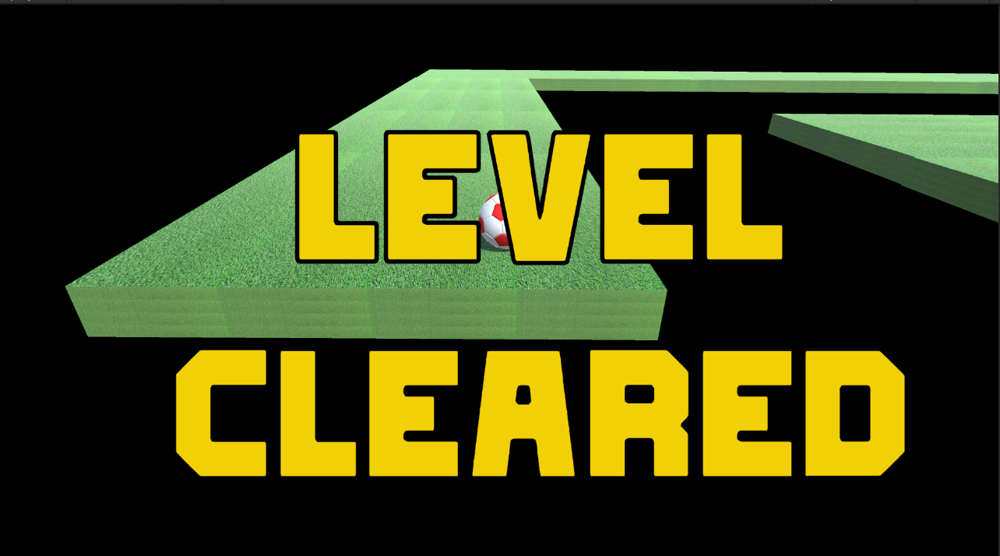
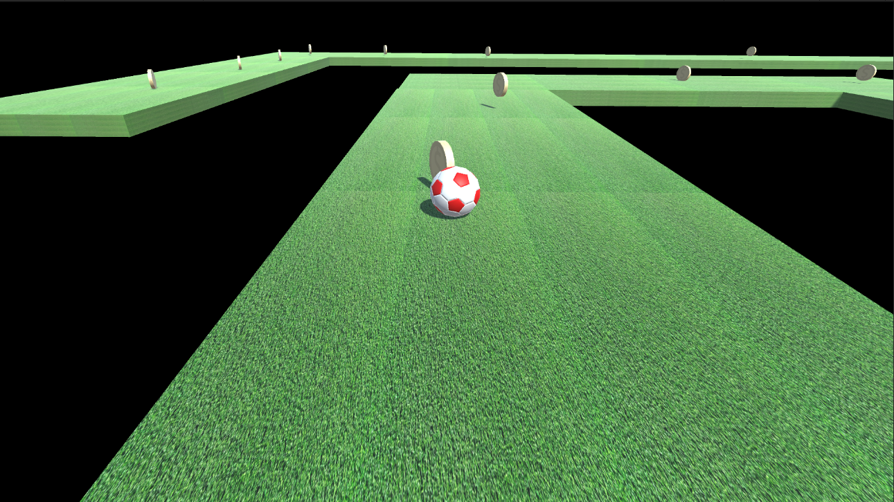

# Simple Football Unity Game

This is a simple Unity game project where you control a player to collect coins and reach a winning condition.

## Table of Contents
- [Gameplay](#gameplay)
- [Project Structure](#project-structure)

## Gameplay

- Use the arrow keys to move the player.
- Collect coins to increase your score.
- Reach a score of 25 to win the game.

## Project Structure

The project consists of the following scripts:

- `Coin.cs`: Handles the rotation of the coins.
- `CameraFollow.cs`: Implements a camera follow feature.
- `PlayerController.cs`: Manages player movement, collision, and scoring.

## Screenshots

